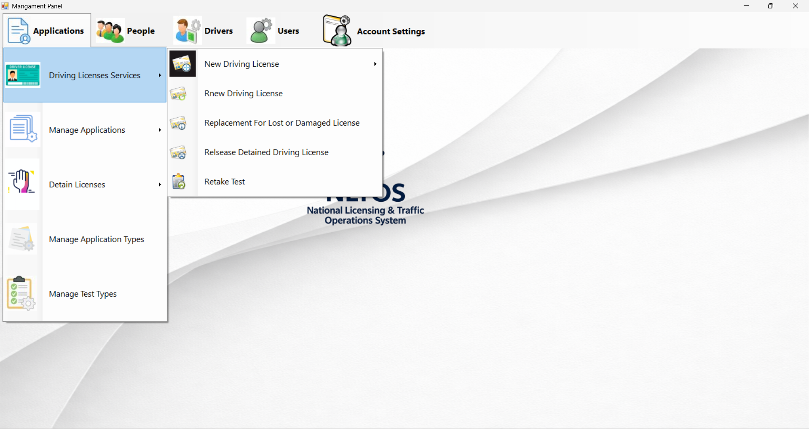
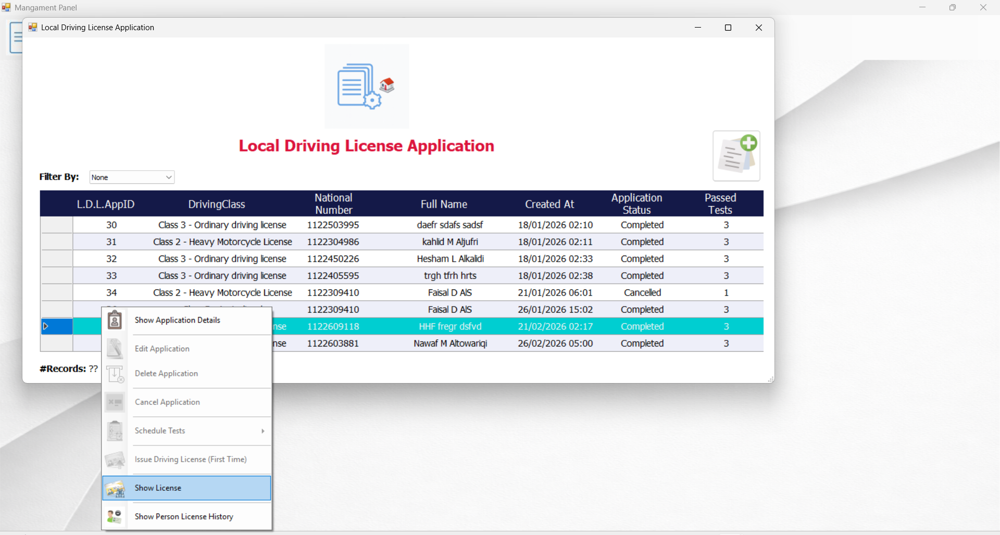
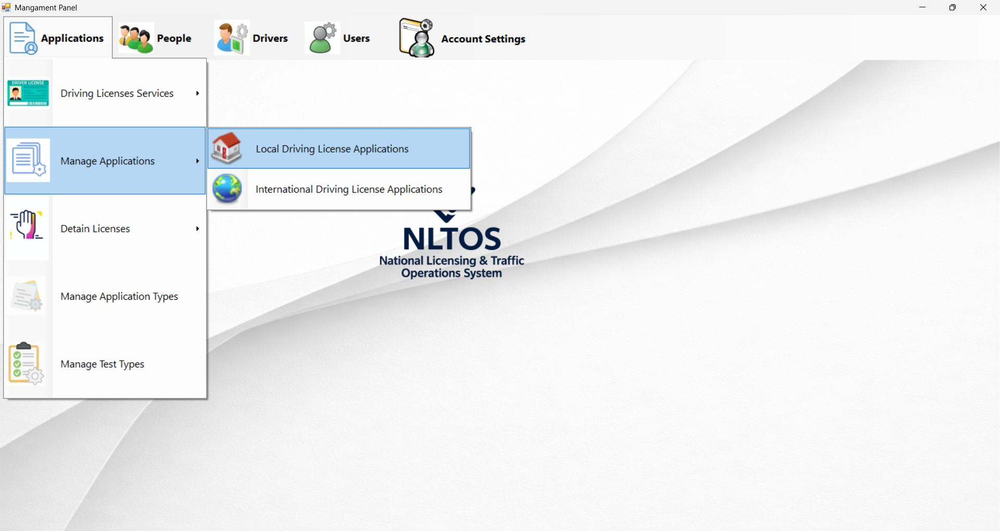
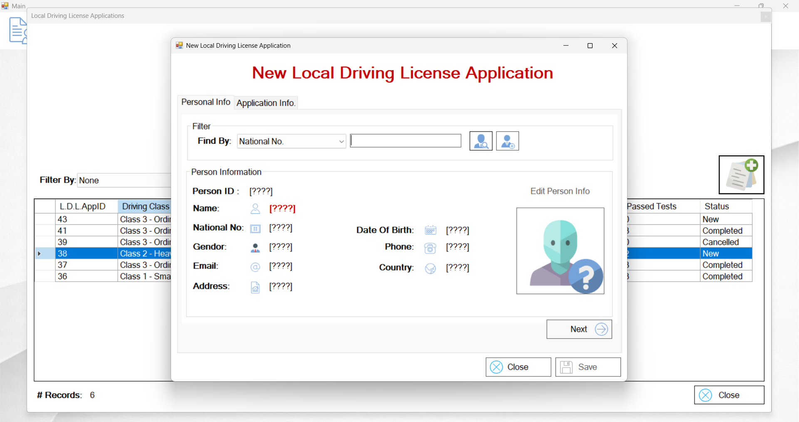
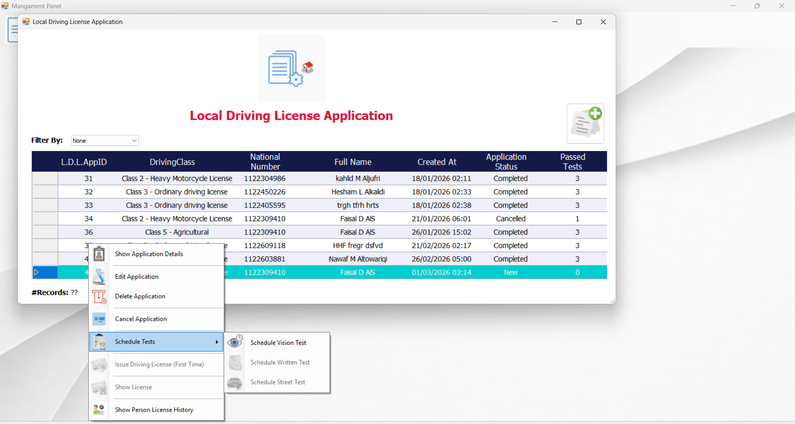
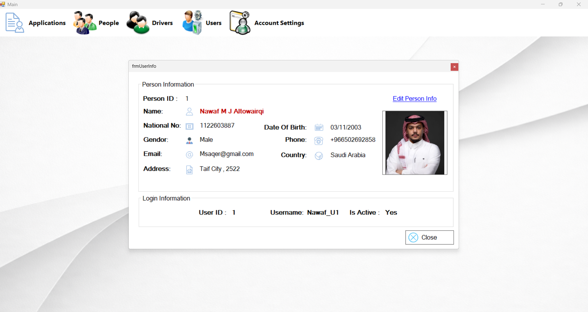

# National Licensing & Traffic Operations System (NLTOS)

Enterprise-Level Desktop Application
Built with C#, Windows Forms, and Structured 3-Tier Architecture

---

## Overview

**NLTOS (National Licensing & Traffic Operations System)** is a full desktop-based licensing management system that simulates real-world traffic authority operations.

This project was designed and developed **end-to-end (from A to Z)** — starting from database modeling and system architecture design, all the way to business rule implementation, workflow control, and UI development.

NLTOS is not a basic CRUD system.
It is a structured, workflow-driven application that focuses on:

* Controlled state transitions
* Strict business rule enforcement
* Layered architecture separation
* Backend-oriented logic design
* Real-world operational constraints

The system reflects how enterprise-level governmental systems manage licensing processes with structured validation and domain-driven rules.

---

## Architecture

The system follows a structured **3-Tier Architecture**:

### 1. Presentation Layer (UI)

* Windows Forms interface
* Controlled screen navigation
* Context-aware actions
* Validation before submission
* No direct database interaction

### 2. Business Logic Layer (BLL)

* Centralized business rule enforcement
* Eligibility validation
* Sequential test logic (Vision → Written → Street)
* Controlled workflow transitions
* State validation before processing
* Edge-case handling and constraint enforcement
* Prevention of invalid operations at the logic level

### 3. Data Access Layer (DAL)

* ADO.NET implementation
* Parameterized SQL queries
* Secure CRUD operations
* Centralized connection management
* Full isolation from UI layer

This structure ensures maintainability, scalability, and clean separation of concerns similar to enterprise-grade systems.

---

## Key Features

* Secure Authentication System (Login, Remember Me, Change Password)
* Full People Management (Create, Update, Delete, Image Handling)
* User Management with activation control and filtering
* Driving License Services:

  * New Local License
  * International License
  * License Renewal
  * Replacement (Lost / Damaged)
* Detained License Management (Detain / Release with validation rules)
* Application Lifecycle Tracking (New, Completed, Cancelled)
* Integrated Test Management:

  * Vision Test
  * Written Test
  * Street Test
  * Sequential validation enforcement
  * Retake logic handling
  * Appointment scheduling with locking mechanism

---

## Workflow & Business Logic Highlights

The system enforces strict operational constraints such as:

* An applicant cannot proceed to the next test without passing the previous stage.
* A license cannot be issued unless all required tests are successfully completed.
* Duplicate active licenses are prevented.
* Detained licenses cannot be processed until properly released.
* Application states transition only through valid business paths.
* Age and eligibility rules are validated before processing.
* Invalid state transitions are blocked at the Business Logic Layer.

All constraints are enforced in the backend logic — not the UI — ensuring structural integrity and predictable system behavior.

---

## Database Architecture

The system is powered by a relational SQL Server database fully designed from scratch.

The database includes:

* Normalized relational schema
* Identity-based primary keys
* Foreign key constraints enforcing referential integrity
* Entity separation (People, Users, Applications, Licenses, Tests)
* Business-driven relationships supporting workflow validation

All database objects can be recreated using:

```
Database/NLTOS_Database.sql
```

---

## How to Run the Project

### 1. Setup the Database

1. Open SQL Server Management Studio (SSMS)
2. Execute:

```
Database/NLTOS_Database.sql
```

The script will:

* Drop the database if it exists
* Recreate it safely
* Build all tables, views, and procedures

---

### 2. Configure Connection String

Update the connection string inside:

```
NLTOS_DataAccess/clsDataAccessSettings.cs
```

Ensure it matches your SQL Server configuration.

---

### 3. Run the Application

1. Open `NLTOS.sln`
2. Build the solution
3. Run the application

---

## Some of screenshots

### Login Screen

.png)

### Main Dashboard



### Manage People



### Manage Applications



### New Local License



### Take Test



### User Information



---

## End-to-End Development Scope

This system was fully designed and implemented by me from concept to final execution.

The development process included:

* Requirements analysis
* Domain modeling
* Database schema design
* System architecture planning
* Multi-layer implementation
* Business workflow modeling
* Validation rule enforcement
* Data integrity management
* UI development
* Cross-layer debugging and refinement

No scaffolding generators or auto-generated frameworks were used.
All logic, structure, and architecture were manually designed and implemented.

---

## Problem-Solving & Backend Growth

Developing NLTOS significantly strengthened my structured problem-solving ability and backend engineering mindset.

Throughout the project, I worked on:

* Translating real-world licensing regulations into enforceable system logic
* Designing controlled workflow transitions
* Preventing invalid states before they occur
* Handling edge cases in sequential processes
* Debugging cross-layer interactions (UI ↔ BLL ↔ DAL)
* Structuring database relationships to support business validation
* Designing logic that enforces rules regardless of UI behavior
* Breaking complex requirements into manageable logical components

This project improved my ability to think architecturally, not just functionally.

It strengthened my capability to:

* Build scalable, layered systems
* Design backend-driven applications
* Model complex domain logic
* Enforce data integrity through structure
* Build large structured systems confidently

---

## What This Project Demonstrates

* Clean 3-Tier Architecture implementation
* Strong separation of concerns
* Backend-oriented system design
* Structured business rule enforcement
* Controlled workflow state management
* Relational database modeling
* End-to-end system development capability
* Strong logical thinking and problem decomposition skills

---

## Developed By

Developed end-to-end by **Nawaf Altowairqi**

GitHub: [https://github.com/TheNawafTech](https://github.com/TheNawafTech)

---

## Feedback

Suggestions, architectural discussions, or improvement ideas are welcome.
Feel free to open an issue or start a discussion on GitHub.

---

لو تبغى نسخة أقوى شوي موجهة للتوظيف (Recruiter-Oriented Version) أكتب لك نسخة ثانية أقصر لكن تأثيرها أعلى 👌
