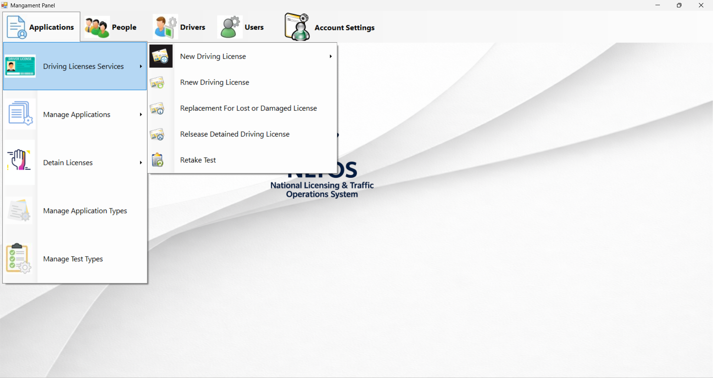
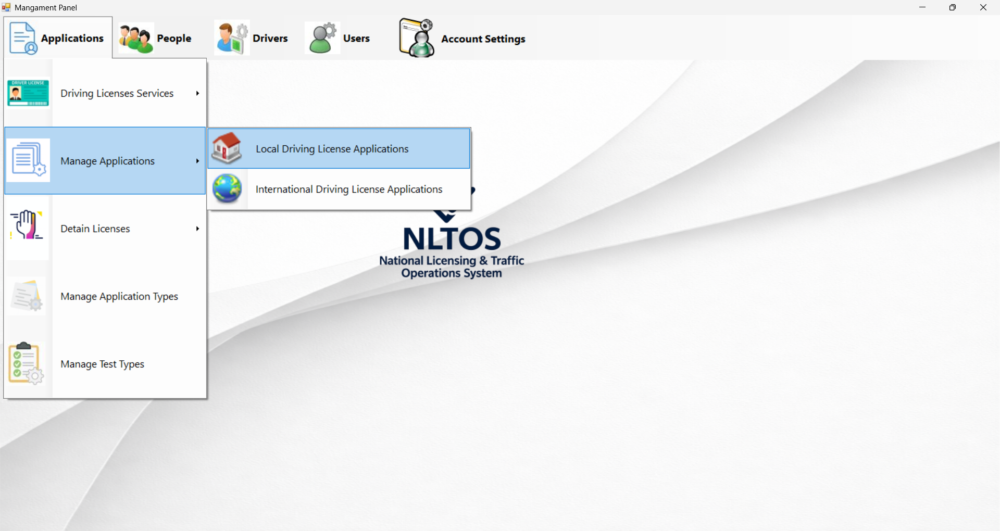
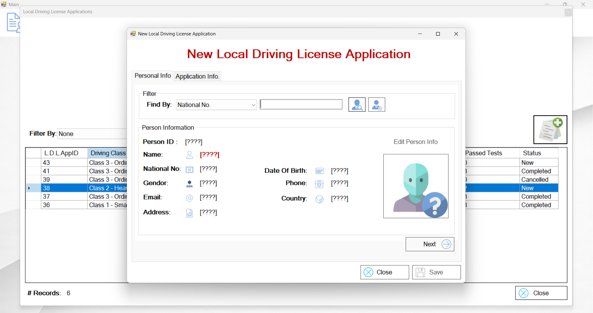
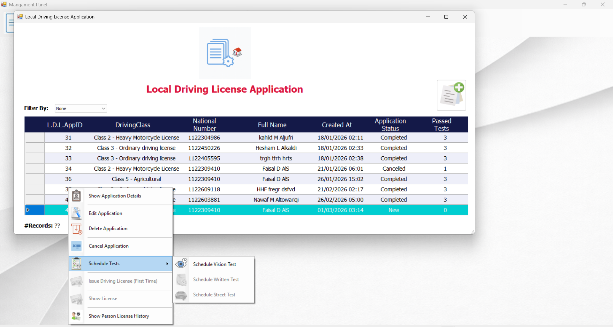

# National Licensing & Traffic Operations System (NLTOS)

A C#/.NET desktop licensing and traffic operations system built with Windows Forms,
SQL Server, ADO.NET and a layered 3-tier architecture.

## Overview

NLTOS models the operations of a driving-license authority. It covers the full path an
applicant takes — registration, application intake, a sequence of driving tests, and
license issuance — along with the services that follow it: renewal, replacement of lost
or damaged licenses, international licenses, and the detention and release of licenses.

The system is a simulation built to model these procedures. It is not connected to any
authority, live service or real data.

## Key Workflows

- **People and users** — registration, updates, image handling, user activation control
- **Local driving-license applications** — intake and lifecycle tracking across new,
  completed and cancelled states
- **Testing** — vision, written and street tests, with appointment scheduling and retakes
- **License issuance** — issuing a license once the application and tests are complete
- **Renewal and replacement** — renewal of expired licenses, replacement of lost or
  damaged ones
- **International licenses** — issued against an existing valid local license
- **Detained licenses** — detention, and release through a dedicated application

## Architecture

The solution is split into three projects, each communicating only with the one
directly beneath it.

| Layer | Project | Responsibility |
| --- | --- | --- |
| Presentation | `NLTOS` | Windows Forms interface, navigation, input validation |
| Business Logic | `NLTOS_Buisness` | Business rules, eligibility checks, workflow state transitions |
| Data Access | `NLTOS_DataAccess` | SQL Server access via ADO.NET using parameterized queries |

The presentation layer holds no SQL and opens no connections; every database call passes
through the data access layer. Workflow rules live in the business layer, so the same
constraints apply regardless of which screen triggers an operation.

## Business Rules & Workflow Constraints

The workflow rules below are enforced in the business layer rather than relying on the
interface alone.

**Tests run in a fixed sequence.** `clsLocalDrivingLicenseApplication.DoesPassPreviousTest`
resolves the prerequisite for each test type — the written test requires a passed vision
test, the street test requires a passed written test — and blocks the attempt if the
prerequisite is unmet.

**A license is not issued until every test is passed.** Issuance is gated on
`clsTest.PassedAllTests`, which checks the application's full test set rather than a
status flag.

**One active application per type per person.**
`clsApplication.DoesPersonHaveActiveApplication` is checked before a new application is
created, preventing duplicate concurrent applications of the same type.

**Certain licensing operations are blocked while a license is detained.**
`clsDetainedLicense.IsLicenseDetained` is used to check the detention state, while
release is handled through its own dedicated application workflow rather than by
clearing a flag.

**Application operations are validated against the current workflow state.**
Business-layer checks prevent an operation when the application's current state or its
prerequisites do not allow it. Enums (`enApplicationType`, `enIssueReason`) define the
permitted application types and issue reasons, while workflow validity itself is
enforced through explicit business rules.

## Tech Stack

```text
C#
.NET Framework 4.8
Windows Forms
SQL Server
ADO.NET
3-Tier Architecture
```

No ORM, micro-ORM or scaffolding is used — the data access layer is hand-written ADO.NET.

## Database

A relational SQL Server database of **14 tables and 5 views**, tied together by
**27 foreign key constraints**.

The main entity groups are people, users, applications, licenses (local, international
and detained), and tests with their appointments. Licenses reference a license class that
carries its own validity length, fees and minimum age.

The complete schema is in [`Database/NLTOS_Database.sql`](Database/NLTOS_Database.sql).

## Demo

A walkthrough of the main workflows and features:

[Watch the system demo](https://youtu.be/0dtG_A0FHwM)

## Screenshots

**Login**


**Driving licenses**



**Applications management**



**New local license application**



**Taking a test**



## Getting Started

**Requirements:** Visual Studio with .NET Framework 4.8, and SQL Server.

1. Clone the repository.
2. Open `Database/NLTOS_Database.sql` in SQL Server Management Studio and execute it.
   The script creates the NLTOS database, builds its tables and views, and seeds it
   with sample data. It expects the database not to exist yet: if one named NLTOS is
   already present the script stops with a message and leaves it untouched, rather
   than overwriting it.
3. Set the connection string in `NLTOS_DataAccess/clsDataAccessSettings.cs` to match
   your SQL Server instance. The default targets a local instance using Windows
   authentication.
4. Open `NLTOS/NLTOS.sln` in Visual Studio and build the solution.
5. Run.

## Project Structure

```text
NLTOS/
├── Database/                 SQL Server schema script
│
├── NLTOS/                    Presentation Layer — Windows Forms
│   ├── Applications/         Local, international, renewal, replacement, release
│   ├── Licenses/             Issuing, detaining, license history
│   ├── People/
│   ├── Drivers/
│   ├── Tests/                Scheduling and test execution
│   ├── User/
│   ├── Login/
│   └── Global Classes/       Formatting, validation, shared helpers
│
├── NLTOS_Buisness/           Business Logic Layer
│
└── NLTOS_DataAccess/         Data Access Layer — ADO.NET
```
